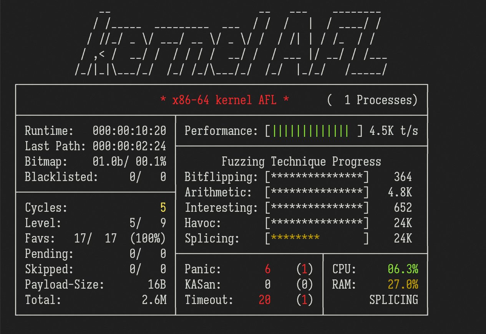

This is [kAFL](https://github.com/RUB-SysSec/kAFL) reworked to run on modern (2024) Linux systems. The original kAFL work is done in 2017 and is never updated ever since, which renders it obsolete and unusable on modern systems.

This work is done on a best-effort basis, so don't expect it to work without problems.

## Screenshot

The screenshot below is taken when fuzzing an [example vulnerable driver](./kAFL-Fuzzer/vuln_drivers/simple/linux_x86-64/kafl_vuln_test.c) installed on a Ubuntu 22.04 guest OS. The spec of the host CPU is `11th Gen Intel(R) Core(TM) i7-11700 @ 2.50GHz`.

Note that those "timeouts" in the screenshot are actually kernel heap corruption bugs, which are not treated as panics when KASAN is not enabled.



## Patch the host kernel

kAFL requires a Linux kernel with KVM-PT patches running as the host OS. This repo provides a [patch for Linux kernel v6.5.13](./kAFL-linux-v6.5.13.patch) (which is the default kernel version for Ubuntu 23.10). If this kernel version differs from yours, you may encounter errors while applying the patch, and you may have to manually adjust the patch contents accordingly.

To apply the patch for your kernel source tree:

```sh
cd $KERNEL_SRC
apply -p1 < $KAFL_SRC/kAFL-Linux-v6.5.13.patch
```

After applying the patch, build the kernel with `CONFIG_KVM_VMX_PT` enabled, and replace the host kernel with the newly built one.

### Example: patching Ubuntu 23.10 kernel

Ref: [Ubuntu Wiki](https://wiki.ubuntu.com/Kernel/BuildYourOwnKernel)

```sh
# Obtain kernel source and build dependencies
sudo apt build-dep linux linux-image-unsigned-$(uname -r)
sudo apt source linux

# Apply kernel patches
cd linux-6.5.0
apply -p1 < ../kAFL-Linux-v6.5.13.patch

# Edit kernel config
fakeroot debian/rules clean
fakeroot debian/rules editconfigs
# Enable CONFIG_KVM_VMX_PT in the config menu

# Build the kernel
fakeroot debian/rules clean
fakeroot debian/rules binary-headers binary-generic binary-perarch

# Install the new kernel and modules
sudo dpkg -i ../linux-image-*.deb ../linux-modules-*.deb
```

## Setup Docker image

kAFL depends on QEMU 2.9 and Python 2.7, which are too old for modern Linux systems. In order to make sure that kAFL runs properly, we need to build a Ubuntu-16.04-based Docker container.

The container needs to be run in privileged mode in order to access KVM-PT via `/dev/kvm`.

### Example commands to build the Docker image

```sh
# Download QEMU source code package
wget 'https://download.qemu.org/qemu-2.9.0.tar.xz'
# Build the Docker image
docker build -t kafl .

# Run the container.
# Specify `--privileged` to allow the container to access /dev/kvm.
# If this still doesn't work, consider running `sudo chmod 666 /dev/kvm`
# outside the container to allow unrestricted access to KVM.
# (Note that this reduces the security level of the host machine.)
docker run -it --rm --privileged kafl

# If you want to run the unit test `test.py`, forward the host's X11 server
# to the container:
docker run -it --rm --privileged --network=host --env "DISPLAY=$DISPLAY" \
    --volume="$HOME/.Xauthority:/root/.Xauthority:rw" kafl
```

## Start fuzzing

Refer to [README-old.md](./README-old.md) for information about how to:

1. Set up the target VM image
1. Build the kAFL loader agents and fuzz drivers
1. Create VM snapshots ready for kAFL fuzzing
1. Run the kAFL fuzzer on the snapshot

Also check out the contents of the next section if you want to fuzz a modern OS with KPTI enabled.

## ⚠️ Notes about KPTI and CR3 filtering

TL;DR: it is highly recommended to **completely disable KPTI in the guest OS**, e.g. by supplying `nopti` in the Linux kernel command line.

---

kAFL utilizes **CR3 filtering** to limit the scope of tracing to a specific user-mode process, as stated in the original paper:

> To limit trace data generation to one specific virtual memory address space, software can use the CR3 Filter. Intel PT will only produce trace data if the CR3 value matches the configured filter value. The CR3 register contains the pointer to the current page table. The value of the CR3 register can thus be used to filter code executed on behalf of a certain ring 3 process, even in ring 0 mode.

However, this assumption is not true for modern OSes with KPTI (Kernel Page Table Isolation) enabled: the kernel creates 2 different page tables for each process, and switches between them when the system enters / exits kernel mode (i.e. ring 0).

Since kAFL is unable to distinguish between user-mode and kernel-mode page tables, kAFL may **fail to capture any trace data** when fuzzing a guest OS with KPTI enabled, resulting in a **0/0 coverage bitmap** in the fuzzer. (You may confirm this issue by modifying the kernel source code to print the result of `vmx_pt_get_data_size2()`: this function produces correct results when running the unit test [KVM-PT/usermode_test/test.c](./KVM-PT/usermode_test/test.c), but not when running the fuzzer.)

---

Moreover, QEMU-PT needs to **read from / write to the guest memory** during the fuzzing process (in order to e.g. disassemble the target kernel module). If the guest OS is using a user-mode page table when this happens, the read / write process will fail.

Therefore, in order to work around these problems, it is highly recommended to **completely disable KPTI in the guest OS**, e.g. by supplying `nopti` in the Linux kernel command line. (There are still other work-arounds to these problems, but that will in turn require additional engineering efforts.)
